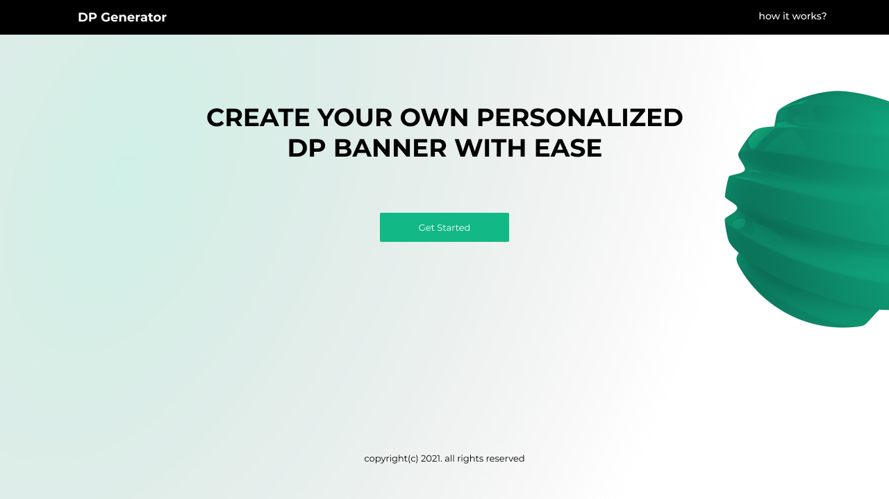

<!-- ABOUT THE PROJECT -->
## About The Project

This is a REST API that was [built as a clone to the DJango REST API](https://github.com/Chinwendu20/I4GDPGenerator) that I created for [ingressive for good](https://ingressive.org/)'s hack for growth. This was the ***problem statment***:

> At I4G we noticed a common problem among several of our community members. Almost every organizer is so keen on the tools to promote their events. Having a local platform where users can create and share personalized DP would increase their campaign reach and also give their events more visibility. The site can also include a comments system and likes features for ranking. Sensing an opportunity to help others with their event campaign, we created a community challenge that will help in exploring possible solutions as part of our program at I4G.

This REST API creates customised display pictures for brands and events to improve brand visibility and awareness.

## Technologies Used

* Nodejs, runtime for running javascript on the server.
* Express js , backend framework for development.
* Cloudinary, used as image's cloud storage.
* PostgreSQL, Database used for project.
* Jimp, for image pocessing.
* Heroku, used for deployment.
* Swagger used for documentation.

## [Endpoints]

[Link to API documentation and testing](https://node-dp-generator.herokuapp.com/api-docs/)

|ROUTE                |DESCRIPTION                    |
|---------------------|-------------------------------|
|post/                |This creates the campaign.     |
|delete/{id}/         |This deletes a campaign|                 
|update/{id}/         |Updates data about a campaign |
|{slug}/              | This is the sharable link sent to people to create
customised DPs using a campaign's banner|
|make/dp/{slug}       | This end point creates the custom display pictures|

## Projects built with this rest API

* DP Generator
  [Live site](https://dp-generator.vercel.app/)| [Github link](https://github.com/eniolajayi/dp-generator)
  
  Presentation embedded in image below:
  

Ensure to contact me on [Linkedin](https://www.linkedin.com/in/maureen-ononiwu-49b3b212a/)

