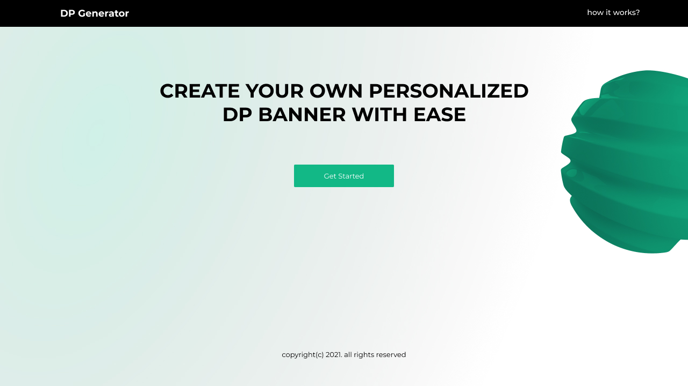

<!-- ABOUT THE PROJECT -->
## About The Project

This is a REST API that was [built as a clone to the DJango REST API](https://github.com/Chinwendu20/I4GDPGenerator) that I created for [ingressive for good](https://ingressive.org/)'s hack for growth. This was the ***problem statment***:

> At I4G we noticed a common problem among several of our community members. Almost every organizer is so keen on the tools to promote their events. Having a local platform where users can create and share personalized DP would increase their campaign reach and also give their events more visibility. The site can also include a comments system and likes features for ranking. Sensing an opportunity to help others with their event campaign, we created a community challenge that will help in exploring possible solutions as part of our program at I4G.

This REST API creates customised display pictures for brands and events to improve brand visibility and awareness.

## Technologies Used

* Nodejs, runtime for running javascript on the server.
* Express js , backend framework for development.
* Cloudinary, used as image's cloud storage.
* PostgreSQL, Database used for project.
* Jimp, for image pocessing.
* AWS ec2, used for deployment.
* Swagger used for documentation.
* Mocha, chai, supertest for creating test
* Joi for schema validation
***Read about my bug chronicles [here](https://www.linkedin.com/posts/maureen-ononiwu_thebugchronicles-nodejs-nodejs-activity-6925646298079461376-wFxE?utm_source=linkedin_share&utm_medium=member_desktop_web)***

## Files and folder in the project

-***readme-images***
This contains images used in read-me of the project.

-***test***
This contains test files for the code

-***upload***
This contains images that were downloaded and uploaded to the server for processing.

-***config.js***
Contains configuration settings for the database connection, multer.js and session storage

-***controller.js***
Contains logic for the routes.

-***helper.js***
Contains user created functions used to avoid repetition in the codebase.

-***index.js***
Entry point for the application.

-***routes.js***
This contains the path definition to routes

-***swagger.yml***
This contains specifiction for Swagger documentation.

## Endpoints

[Link to API Documentation](https://documenter.getpostman.com/view/14112837/UyrGBtwp)
[Test end points](http://ec2-54-146-255-154.compute-1.amazonaws.com/api-docs/)
<!-- [Link to API documentation and testing](https://nodejs-dp-generator.herokuapp.com/api-docs/) (Please click this link to test the end points) -->

|ROUTE                |DESCRIPTION                    |
|---------------------|-------------------------------|
|POST /campaign/      |This creates the campaign.     |
|DELETE /campaign/{id}|This deletes a campaign        |                 
|UPDATE /campaign/{id |Updates data about a campaign  |
|/{slug}/             | This is the sharable link sent to people to create customised DPs using a campaign's banner|
|/make/dp/{slug}      | This end point creates the custom display pictures|

## Good to know!!

This project was originally built with Django but when I discovered in early April that Django projects were not good code samples for the MLH fellowship. I rewrote the code and submitted my application on the 26th of the same month having no prior knowledge or experience with nodejs. The project built for the hackathon was created with Django, here is the [link](https://github.com/Chinwendu20/I4GDPGenerator)

## Project built for the hackathon

* DP Generator
  [Live site](https://dp-generator.vercel.app/)| [Github link to frontend project](https://github.com/eniolajayi/dp-generator)
  
  [Live demo](https://www.linkedin.com/posts/maureen-ononiwu_hackforgrowth-codesandboxchallenge-codenewbie-activity-6914716433453043713-wTwe?utm_source=linkedin_share&utm_medium=member_desktop_web) (Please click this link to watch the demo)
  
  Presentation embedded in image below:
  

Ensure to contact me on [Linkedin](https://www.linkedin.com/in/maureen-ononiwu-49b3b212a/)

